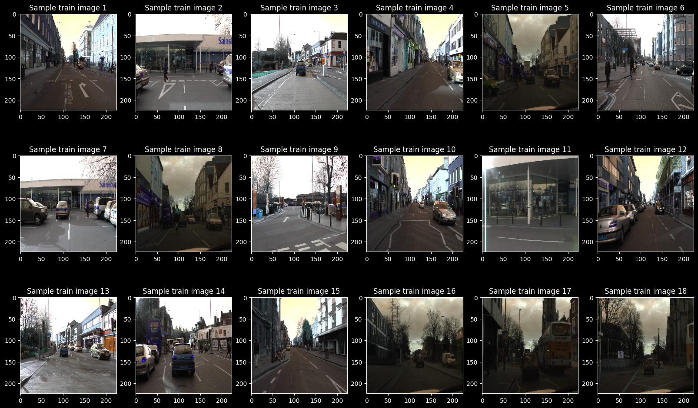

# Project 2 Self Driving Car

## Latar Belakang
Seiring berjalannya waktu teknology semakin berkembang. Robot otomasi marak dikembangkan. Transportasi tanpa awak pun tidak luput dari perkembangan teknology. Semantic segmentation adalah salah satu metode yang digunakan untuk Self Driving Car. 

## Informasi Umum
Dalam Repository ini saya mencoba implementasikan UNet([paper](https://arxiv.org/abs/1505.04597v1)|[code](https://github.com/milesial/Pytorch-UNet/blob/67bf11b4db4c5f2891bd7e8e7f58bcde8ee2d2db/unet/unet_model.py#L8)) dan FCN8([paper](https://arxiv.org/abs/1411.4038)|[code](https://github.com/Gurupradeep/FCN-for-Semantic-Segmentation)) untuk semantic segmentation dengan dataset  [Cityscapes](https://drive.google.com/file/d/131x4PJWCHGC8Iu8WkwGyCFDLgVMPoqhM/view?usp=sharing).
Contoh sampel gambar dan anotasinya:
 

## Langkah-langkah
Proses implementasi:
1. Import library-library
2. Download dataset (Cityscapes) dan dibagi menjadi data train dan data test
3. Normalisasi image diubah menjadi 224x224
4. Membuat Model UNet dan FCN8
5. Membuat function Dice Loss dan Dice Coef
6. Melakukan training model
7. Melakukan evaluasi model

## Hasil Uji
Grafik Evaluation UNet

Grafik Evaluation FCN8

## Hasil Prediction
UNet

FCN8

## Kesimpulan
FCN8 memiliki Dice Loss dan Dice Coef yang lebih baik daripada UNet yakni sebesar Dice Loss **0.3674** dan Dice Coef **0.6328**. Sedangkan untuk UNet mendapatkan Dice Loss 0.4956 dan Dice Coef 0.5043
